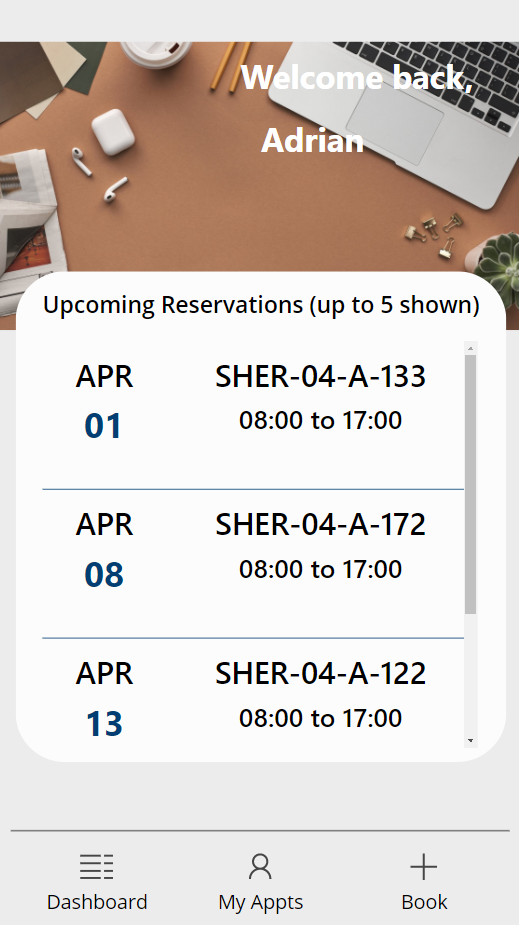

## Desk Booking Template

This Power App is based on an original created by April Dunham but updated and improved to add desk validation – so you can set up some desks as available and others as not available.

The Power App allows you to create and manage reservations for desks but it could be modified for other types of reservation scenario.   It's designed to be a mobile app which contains a dashboard page to manage reservations and screens to create a new reservation.  It can also be run as a Teams app if you wish but the display will show as a “mobile” format app.

The app looks at the list of desks within the Desks SharePoint List and validates which desks are available (those marked with a 1 rather than a 0 in the availability column).  You can change the desk availability by changing the value from 1 to 0 or vice versa (0 = off or unavailable and 1 = on or available).

The app is currently set to use an Imperial College picture on the home screen.  This can be changed as required by uploading your own picture in the Power App.

* * *

## Deployment Instructions
1. Download the Desk Booking App Zip, the Desk Reservation Provisioner Zip and the Import the desk data from excel Zip files.

2. Go to flow.microsoft.com

3. Import the Desk Reservation Provisioner Zip into Power Automate

4. Edit the Action that says "! Enter URL of SP Site to Deploy to here" and put in your SharePoint site url that you want the underlying list to reside.  Keep not2 of that site URL.

5. Run the "Desk Reservation Provisioner" Flow. This will create the necessary resources in SharePoint.

6. Go to make.powerapps.com

7. Click on the Apps tabs on the left hand rail

8. Click 'Import Canvas App' in the ribbon and browse to the Desk Booking App Zip File

9. Open the app in edit mode.

10. Click the data connections tab and delete all of the SharePoint Data Connections in the app

11. Search for SharePoint and add in the new SharePoint lists in your tenant that you just provisioned.

12. Edit the homepage picture to something appropriate for your institution

13. Download the “Desk Reservation App – Desk Import Template.xlsx” file.

14. Edit the excel file and enter the details of the desks that you want to appear in your desks list.

15. Go to flow.microsoft.com

16. Import the “Import the Desk Data from the excel file.zip” and update the excel and SharePoint references to point at the excel file of desks and the SharePoint list where you wish to import the data to.

17. Validate the desk data and set any desks that are not available to a value of 0 in the “Active” column.  N.B. the desk importer does not respect the value in the excel file as the active column is a number column and has to be set at import as either 1 or 0 then amended after data import.

18. Validate the app by running and checking the desks appear and are reservable.

19. Whilst not mandatory, it is recommended that you hide the lists from view in the SharePoint site.

20. You should also make the Desks list “Read” only for members so that they cannot alter the desk details.

21. It is also recommended to make the reservation list “Contribute” for members.

